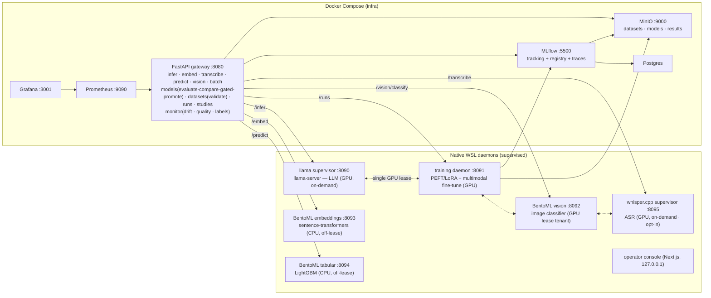

# MLOps-Lite

A lightweight, full-lifecycle MLOps platform that runs **locally on one machine** — data → train →
register → serve → monitor → retrain — built around a single GPU that holds **at most one tenant at
a time under a race-free lease**. A spec-driven (GitHub Spec Kit) reimagining of a heavier reference
platform, sized to a laptop.

> Status: **merged through increment 014** (010 validated on hardware; 011–014 merged via the
> dual-bot review loop). Five served modalities (LLM text-generation, vision image-classification,
> embeddings, ASR, tabular), a multimodal trainer (LLM + vision + embeddings + ASR fine-tuning with
> lineage/adapter-chaining), a **gated promotion** path (offline eval harness + champion-challenger),
> **Optuna hyperparameter optimization**, **model-quality monitoring** with ground-truth labels, and
> **offline batch inference + data-validation gates** — all over a single race-free GPU lease.
> Constitution `v1.4.0`. Reference stack on MLflow `3.14.0`.
>
> Per-increment detail lives under [`specs/`](specs/) (each has `spec.md` / `plan.md` / `tasks.md`);
> [`specs/001-mlops-platform/quickstart.md`](specs/001-mlops-platform/quickstart.md) is the run guide.

## Architecture

Infrastructure runs in Docker Compose. GPU- and CPU-bound model services run **natively in WSL** —
the *hybrid GPU* model (constitution v1.2.0): the container engine has no NVIDIA runtime, but the
GPU works natively in WSL, so the gateway proxies to native daemons over an injected IP.



**One GPU tenant under a single race-free lease (Principle II, non-negotiable; constitution v1.4.0).**
At most one tenant holds the GPU at any instant — **LLM**, **vision**, **ASR**, *or* a **training
run**. Generalized in increment 008 from the original "one LLM in VRAM" rule. The lease is an atomic
PID-stamped lockfile on the WSL filesystem (`serving/gpu_lease.py`, stdlib-only): `O_CREAT|O_EXCL`
create + `os.kill(pid,0)` stale-holder reclaim, with an `fcntl.flock` sidecar serializing the
read-decide-claim window. It tracks the **VRAM-holding child** (e.g. `llama-server`), survives a
gateway restart, and self-heals on a dead holder. Serving releases VRAM after an idle timeout.
**CPU modalities (embeddings, tabular) are exempt** — they never touch the lease, so RAG embed→LLM
never thrashes.

## Lifecycle, modalities & user stories

| Phase | Story | What it does |
|------|-------|--------------|
| 3 | **US1** serve | `POST /infer` (+`/infer/stream`) → on-demand GPU LLM inference via `llama-server`; `POST /vision/classify` → image classification (BentoML, **GPU lease tenant** since 008) |
| 4 | **US2** register | `POST /models` + promote via MLflow aliases; routing resolves the `@serving` version |
| 5 | **US3** datasets | content-addressed, immutable dataset versions on MinIO |
| 6 | **US4** fine-tune | pinned dataset → LoRA on the GPU (Prefect ephemeral) → adapter→GGUF → registered, servable |
| 7 | **US5** monitor | PSI drift → on breach auto-launch a retrain run; Grafana dashboard |

**Additive modality increments (009 serve · 010 train):**

| Modality | Serve (009) | Serving on GPU lease? | Fine-tune (010) |
|---|---|---|---|
| text-generation (LLM) | `llama.cpp` (`/infer`) | yes (on-demand) | PEFT/LoRA → GGUF (US4) |
| image-classification | BentoML (`/vision/classify`) | yes (on-demand) | transfer-learning head |
| embedding | BentoML sentence-transformers (`/embed`) | **no** (CPU) | sentence-transformers FT |
| asr | whisper.cpp daemon (`/transcribe`) | yes (on-demand, opt-in) | Whisper FT → HF→ggml convert |
| tabular | BentoML LightGBM (`/predict`) | **no** (CPU) | doc-only AutoGluon upgrade path |

> The "GPU lease?" column is about **serving** — embeddings and tabular serve on CPU and never touch
> the lease. **Fine-tuning is different**: *every* fine-tune (all four trainable modalities, embeddings
> included) is the heaviest single GPU-lease tenant — the trainer acquires the lease before dispatch,
> so an embedding fine-tune launched while another tenant is resident gets a `409 GPU busy`.

Routing is **registry-metadata-driven for `/infer`** (009): every model version carries a `task` tag
(text-generation / image-classification / embedding / asr / tabular) and a `serving_engine` tag
(llama.cpp / bentoml / whisper.cpp). The `/infer` path and the Infer tab resolve their target off these
tags (`resolve_serving_target`) rather than hard-coded model wiring, and the **Infer tab renders one
panel per `task`** discovered from the registry — adding a future modality means registering a model
with a `task` tag and dropping in a small renderer. The **non-LLM serving routes**
(`/vision/classify`, `/embed`, `/predict`, `/transcribe`) currently proxy a **fixed per-daemon env URL**
(`BENTO_URL` / `EMBED_URL` / `TABULAR_URL` / `ASR_URL`), so promoting a new version of those modalities
updates the registry tag + Infer-panel metadata but doesn't change which version the daemon serves until
it reloads. Fine-tuned versions (010) land with the same serving tags **plus lineage** (`base_model`,
parent run) so adapters can be chained and 009's servers can load them. Promotion to `@serving` is
**operator-driven** (alias-based) and, since **011**, production promotions run through an **evaluation
gate** (below).

## Run it

See [quickstart](specs/001-mlops-platform/quickstart.md).

**One command (002/US3)** — bring up *everything* (Compose infra + native daemons under the
supervisor + gateway↔daemon IP wiring), and tear it down releasing the GPU:

```powershell
./scripts/gen_secrets.ps1     # once: generate .env (random creds + an API key)
./scripts/up_all.ps1          # infra + supervised daemons + wiring, waits until all reachable
./scripts/down_all.ps1        # stops daemons (no GPU orphans) + infra   (make up-all / down-all)
```

`up_all` supervises the **default daemon set** — `serving` (LLM), `training`, `vision`, `embed`,
`tabular`, and `ui` — and wires their dynamic WSL IPs into the gateway (`SERVING_URL`, `TRAINER_URL`,
`BENTO_URL`, `EMBED_URL`, `TABULAR_URL`, `ASR_URL`). **ASR is opt-in**: whisper.cpp needs a manual
CUDA build, so it is not in the default set — build it and enable it explicitly. The supervisor reads
`SUPERVISE_DAEMONS` at startup, so if it's already running you must **stop it first** for the expanded
set to take effect:

```bash
bash serving/whispercpp/build.sh                              # one-time: CUDA whisper.cpp build
bash scripts/supervisor_down.sh                              # stop the running supervisor (if up)
SUPERVISE_DAEMONS=serving,training,vision,embed,tabular,asr,ui bash scripts/supervisor_up.sh
```

<details><summary>Manual, step-by-step (what up_all automates)</summary>

```bash
./scripts/gen_secrets.ps1                # 002/US1: generate .env (random creds + an API key)
make up                                  # foundational stack
python3 supervisor/supervise.py          # WSL: supervises the native daemons (health + restart)
~/mlops-train/bin/python scripts/seed_vision_model.py   # one-time: seed the vision model
./scripts/serve_up.ps1                   # PowerShell: bring up the stack pointed at the daemons
export GATEWAY_API_KEY=mll_...           # 002/US1: the key gen_secrets printed (protected routes)
# NOTE: serve_up.ps1 only wires SERVING/TRAINER/BENTO URLs today — for the 009 modalities
# (embed/tabular/asr) prefer up_all.ps1, which injects EMBED_URL/TABULAR_URL/ASR_URL too.
pytest                                   # validate every phase against the live, keyed stack
```

</details>

> **Auth (002/US1 + 005/US2 fail-closed).** The lifecycle endpoints require an `X-API-Key` header
> once `GATEWAY_API_KEYS` is set (`gen_secrets` provisions one); `/healthz` and `/metrics` stay open.
> **Fail-closed by default (005):** with no key configured the gateway still boots but protected
> routes return `401` — set `GATEWAY_ALLOW_OPEN=1` for the documented dev escape hatch (runs open,
> warns loudly). Tests pick up `GATEWAY_API_KEY` from the env. **Key rotation needs a gateway
> restart** — the key set is read once at startup (FR-046).
>
> **Network exposure (005/US1).** Every published Compose port binds to **loopback (`127.0.0.1`)** by
> default — nothing answers on the LAN. Set `BIND_ADDR=0.0.0.0` in `.env` only for intentional LAN
> exposure. The operator console binds `127.0.0.1` only and talks to the gateway through a
> key-injecting BFF (keys never reach the browser).
>
> **Tests (005/US5).** `pytest` is the entry point — it runs the integration suite against a live,
> keyed stack and **skips cleanly** when the stack/key/daemons/WSL are absent (no collect-nothing
> exit-5). Each `tests/test_*.py` also still runs standalone (`python tests/test_serving.py`). The
> single-tenant lease serializes the GPU tests, so a few GPU-tenant tests pass **in isolation** but
> show as "failures" under the full suite — that is the lease working, not a regression.
>
> **Supervisor (002/US2, extended through 009).** One process supervisor in WSL starts the native
> daemons, health-checks them, and restarts any that die (exponential backoff). State is at
> `:8099/status`; the gateway aggregates daemon reachability at `/platform/health` (ASR is marked
> `optional` so `up_all` doesn't stall when it isn't built).

## Operator console (003 + 004)

A Next.js operator console (native WSL, `127.0.0.1`, terminal/man-page aesthetic, JetBrains Mono)
sits over a key-injecting BFF and is itself a supervised daemon. Tabs cover infer / models /
datasets / runs / monitor / platform, with live updates over gateway SSE (`/infer/stream`,
`/platform/events`, `/runs/{id}/events`). 004 hardened the BFF (route-allowlist, same-origin/CSRF
guard, CSP/security headers, scoped Grafana embed) and added a `/readyz` readiness probe.

## GPU lease & vision-on-GPU (008)

Increment 008 generalized Principle II from "one LLM in VRAM" to **one GPU tenant under a single
race-free lease** and moved vision onto the GPU:

- **Lease primitive** — `serving/gpu_lease.py` (stdlib): atomic PID-stamped lockfile with
  `flock`-serialized claim + stale-holder reclaim. Acquired by the native WSL daemons that actually
  hold the GPU; the gateway only *reads* the current holder for the UI status line, it never
  arbitrates. **Live-VRAM admission** (`nvidia-smi` free) replaces a static budget, with a
  static-budget fallback when the GPU is unreadable.
- **Vision-on-GPU** — the BentoML classifier loads MobileNet to `cuda` as a lease tenant and holds
  its lock across load+inference so the idle watcher can't release mid-flight; it refuses (and the
  gateway returns `409`) while another tenant holds the lease.
- **Lease tracks the VRAM-holding child** (008.1) — the lease records the `llama-server`/`whisper-server`
  child PID, so an orphaned child keeps the lease held and a dead child frees it even if the
  supervisor lives.
- **Infer tab** shows a read-only `serving:` status line; `classify` is disabled-with-hint while the
  GPU is held (swap-on-demand deferred).

## Evaluation gates (011)

Before 011, `promote(name, version)` moved the `@serving` alias on command with no check that the new
version was actually better — the exact gap that let a prior project serve "whatever last registered."
011 adds the connective tissue, all wired into the **single `registry.promote` choke-point** — the gate
applies to every operator/production promotion. (The `scripts/seed_*` bootstrap scripts set the
`@serving` alias directly via MLflow and are explicit, documented gate exceptions for initial seeding.)

- **Offline eval harness** (`gateway/app/evaluation.py`) scores a model version on a small **held-out
  benchmark** under [`benchmarks/`](benchmarks/) and logs the primary metric to MLflow. Each metric
  carries a **direction**: vision = top-1 accuracy (higher-better), LLM = task-accuracy on a QA set
  (higher-better, perplexity fallback); ASR=WER / embeddings=recall@k / tabular=AUC are guidance stubs
  until those serving paths mature. Metrics are **pure-Python** (no `numpy`/`scipy`/`jiwer` — Principle
  III); every `EvalResult` records the benchmark's name + SHA-256 digest for provenance.
- **Promotion gate** compares the candidate against the `@serving` incumbent honouring metric direction
  and like-for-like (same modality + metric). **Default = BLOCK** a regression beyond a small tolerance;
  an explicit operator **override** bypasses a block, and a config switches the whole gate to
  **warn-on-regression**. No incumbent ⇒ pass.
- **Offline champion-challenger** declares a winner from both versions' **logged metrics** (since 015 —
  see below; no model reload). Shadow-replay of logged requests is deferred to a 013-dependent follow-on.

```bash
curl -X POST localhost:8080/models/<name>/evaluate -H "X-API-Key: $KEY" \
  -d '{"version":"1"}'                                                    # score a version → MLflow
curl -X POST localhost:8080/models/<name>/compare  -H "X-API-Key: $KEY" \
  -d '{"challenger":"2"}'                                                 # champion (@serving) vs challenger
python scripts/eval_model.py evaluate <name> <version>                   # one-shot harness (no gateway)
# POST /models/<name>/promote is now gated — body {"version":"N","override":true} bypasses a block.
```

## Score-at-registration (015 — closes SC-068)

Before 015, the per-modality predictors behind `evaluate`/`compare` scored whichever version the serving
daemon **currently held**, not the requested registered version — so a live `compare` of a non-resident
challenger was degenerate, the 012 HPO objective was meaningless (every trial scored the same resident
model), and the native trainer couldn't even reach the Docker-only serving hostnames (`Name or service
not known`). 015 closes this by making every fine-tuned version **born with its eval metric**:

- **Every fine-tune scores its own model in-process at registration**, inside its existing GPU-lease hold,
  and logs the primary metric on the new version (`training/scoring/`). LLM/ASR score the **served
  artifact** (the GGUF via a transient `llama-server`; the ggml via a transient `whisper-cli`) after the
  HF training model is freed; vision/embeddings score the **in-memory** trained model that *is* what's
  served. **One model in VRAM at any instant** (Principle II) — sequential within the single hold.
- **The gate, `compare`, quality, and the HPO objective read those logged metrics** — no serving-daemon
  reload, no per-version loading machinery. The HPO objective is now each trial's own registered metric,
  so the study optimizes toward the genuinely best candidate, with no `host.docker.internal` call.
- **All four trainable modalities** (LLM, vision, ASR, embeddings) ship a content-hashed held-out fixture
  under [`benchmarks/`](benchmarks/) (`asr/wer_smoke.jsonl`, `embedding/recall_smoke.jsonl` are new).
- **Gateway `/evaluate` is guarded** (FR-143): the `@serving` version is scored as before, a
  registration-scored version returns its logged metric, and a non-`@serving` version with **no** logged
  metric is **refused with a clear `409`** — never a silent score of the wrong (resident) model.

No new dependency, no new service, no change to the frozen GPU stack, and batch (014) still scores the
`@serving` model. The metric/direction math (011) is unchanged.

## Hyperparameter optimization (012)

012 wraps the existing trainer in an **Optuna** study (`training/flows/hpo.py`, search spaces in
`training/search_spaces.py`) that optimizes toward **011's eval metric** as its objective. A study runs
N trials, each a real `finetune_flow` invocation with one sampled hyperparameter set, recorded as an
MLflow **child run** under the study's parent run; the best trial is registered as a version eligible
for the 011 gate. Optuna is pure-Python and server-less — **one light dependency (`optuna==4.9.0`)**,
no new runtime. Because each trial is a fine-tune and therefore a GPU-lease tenant, **trials run
strictly sequentially** (`n_jobs=1`), each fully releasing VRAM before the next — total wall-clock =
`n_trials × per-train-time`.

```bash
curl -X POST localhost:8080/studies -H "X-API-Key: $KEY" \
  -d '{"dataset_name":"qa-demo","dataset_version":"1","output_name":"qa-hpo","modality":"llm","n_trials":3}'
curl localhost:8080/studies/<study_id> -H "X-API-Key: $KEY"     # study status + best trial
```

> `modality` is one of `llm` / `vision` / `embeddings` / `asr` (the trainer's set), not the registry
> `task` tag. `dataset_name` + `dataset_version` pin the training data; `output_name` is the registered
> model name the best trial lands under.

## Quality monitoring with ground truth (013)

The 001 monitor watches only the **input** side — pure-Python PSI over feature distributions (drift on
what goes *in*). 013 adds the missing half: **output/concept-drift** monitoring against ground truth,
complementing (not replacing) the PSI signal.

- **Prediction logging** — every served prediction is logged fire-and-forget / fail-open with a stable
  prediction id + the resolved model version (wired into the `infer` / `stream` / `vision` routes),
  landing in the existing MinIO `results` store.
- **Delayed labels** — `POST /monitor/labels` attaches ground-truth labels whenever they become known
  (minutes to days later); a thin client `data/submit_labels.py` drives it.
- **Windowed quality** — `POST /monitor/quality/check` computes per-modality quality over a time window
  (reusing 011's metric libs), compares it **relative to a like-for-like baseline**, and on a breach
  fires the **same** `_launch_retrain` trigger as input-drift (OR-combined, with a cooldown).
  `GET /monitor/quality` lists reports; the Grafana dashboard is extended with the quality series.
- **Dependency-light.** Pure-Python + the 011 metric libs; `monitoring.py` (PSI) is untouched, and
  quality is CPU-side aggregation off the request path — never a second resident model (Principle II).

## Shadow-replay champion-challenger (016 — production-traffic evaluation)

011's `compare()` judges a challenger on a fixed held-out benchmark; **016** judges it on the **real
traffic the champion actually served**. It is **advisory** — it never touches the 011/015 promotion gate
(production labels are sparse/delayed, so gating on them would stall promotions). Scope = the
labeled-prediction modalities **LLM / vision / ASR**.

- **Recoverable input capture** — 013's prediction logging is extended (behind the `QUALITY_CAPTURE_IO`
  opt-in, under a **sampled + capped + TTL** policy — `SHADOW_CAPTURE_*`) to store the *recoverable* served
  input (prompt / image / audio — vision was a SHA hash only, ASR nothing) under an `inputs/<modality>/`
  prefix. Fire-and-forget + fail-open (never affects serving), bounded on the constrained drive.
- **`POST /models/{name}/shadow-replay {challenger}`** dispatches an async **trainer-side** job: it loads
  the challenger's served artifact **under the single GPU lease** (one model in VRAM, sequential — 015's
  in-process scorers) and scores it over the **captured ∩ labeled** replay window; the **champion is not
  re-run** (its predictions are already logged — 013). The job persists an advisory per-metric verdict
  (`results` `shadow/` prefix); `GET /models/{name}/shadow-replay/{id}` returns it.
- **Honest degradation** — `< QUALITY_MIN_PAIRS` captured∩labeled pairs → `insufficient_data`; capture
  disabled → `no_corpus`; a modality with no captured inputs → a clear refusal — never a misleading verdict.

```bash
curl -X POST localhost:8080/models/<name>/shadow-replay -H "X-API-Key: $KEY" \
  -d '{"challenger":"3"}'                                                  # → 202 {shadow_id, window_n}
curl localhost:8080/models/<name>/shadow-replay/<shadow_id> -H "X-API-Key: $KEY"  # → advisory verdict
```

No new dependency / service — reuses 013's logging, 015's scorers, and 011's pure-Python metrics.

## Batch inference & data-validation gates (014)

014 closes the two open lifecycle edges — offline scoring and pre-training readiness:

- **Offline batch inference** — `POST /batch` (+ `GET /batch/{batch_id}`) scores a registered MinIO
  dataset version against a served model as an **ephemeral Prefect flow on the native daemon**
  (`training/flows/batch_infer.py`), writing content-addressed results back to MinIO. A GPU-backed model
  goes **through the single GPU lease** — acquire once, iterate rows, release at batch end (never a
  second model in VRAM); CPU/tabular models score off-lease. *Like 011's `compare` and 012's eval,
  the batch flow scores against whichever version the serving tenant currently holds* (the request's
  `model`/`registry_version` are recorded for provenance) — promote/serve the intended version before
  launching a batch.
- **Data-validation gates** — lightweight **hand-rolled** checks (schema/columns, null rate, value
  ranges, label balance, row count) over the dataset bytes, gating `finetune_flow` **before**
  `train_lora` so a malformed/empty/schema-drifted dataset fails fast at the edge instead of deep in the
  LoRA loop. Also exposed advisory via `POST /datasets/{name}/{version}/validate`. **Not** Great
  Expectations / pandera — same "deliver the guarantee, lighter" precedent as DVC→content-addressing and
  Evidently→PSI (Principle III). Surfaced in the operator console (datasets validation report + a Runs
  batch launcher).

## Inference traces (006, on MLflow 3.x since 007)

Every `POST /infer` and `POST /infer/stream` emits one **MLflow trace** (prompt, params, output,
`load_ms`/`infer_ms`, model, `usage`, promoted `registry_version`, status) into the
**`mlops-lite-inference`** experiment — open MLflow at `http://127.0.0.1:5500`, pick that experiment,
and use the **Traces** tab.

- **Manual, not autolog.** The gateway proxies inference over `httpx`, so `mlflow.autolog()` captures
  nothing — 006 instruments the proxy paths directly (reusing the MLflow already present; no new dep).
  007 ported the implementation to MLflow 3.x spans.
- **Never slows inference.** Traces are emitted *fire-and-forget* off the request path and tracing is
  *fail-open* — if MLflow is down the inference still succeeds. The GPU lease is never held for tracing.
- **Toggles** (`.env`): `MLFLOW_TRACING_ENABLED=0` disables it; `MLFLOW_TRACE_CAPTURE_IO=0` keeps
  timing/metadata but omits prompt/output bodies.
- **Retention.** No retention policy ships — prune traces or the experiment from the MLflow UI.

## Default stack (each stage swappable — Principle V)

MinIO (storage) · MLflow `3.14.0` (tracking + registry + traces) · `llama.cpp` (LLM serving) ·
BentoML (vision / embeddings / tabular serving) · whisper.cpp (ASR serving) · sentence-transformers
(embeddings) · LightGBM (tabular) · PyTorch + PEFT/LoRA (training, Prefect-structured) · Optuna
(hyperparameter search, server-less) · pure-Python PSI (input drift) + pure-Python eval/quality metrics
(gates + ground-truth monitoring) + hand-rolled data validation ·
Prometheus + Grafana (observability).

Three components diverge from the plan's first-choice tools, each justified by **Lightweight
Footprint** (Principle III) and **OSS & Swappable** (Principle V), and each isolated behind one
module so it can be swapped back:

| Plan default | Used instead | Why |
|---|---|---|
| DVC | content-addressing on MinIO | DVC needs git + CLI + a commit per version; ill-fitting for an API flow |
| Prefect *server* | Prefect *ephemeral* + native daemon | an always-on server is weight MLflow already covers for run tracking |
| Evidently | pure-Python PSI | Evidently's pandas/scipy/plotly would bloat the gateway image on the constrained Windows C: drive |

**Frozen GPU stack (NON-NEGOTIABLE).** The hard-won Blackwell sm_120 pins — `torch+cu128`,
`torchvision+cu128`, and the fine-tune libraries (`transformers`/`peft`/`accelerate`/`datasets`) —
are validated against the GPU and the LoRA→GGUF pipeline and are **not** churned by stack refreshes.
007 modernized everything *around* them (MLflow 2.18→3.14, pinned infra images by digest, gateway on
`python:3.12`, UI on Next 15.5.19 / React 19.2) while leaving the GPU stack untouched.

## Disk frugality (Principle III)

Container images live on the Windows C: drive (the tight constraint); model/training artifacts
live in WSL (`~`, ample). Keep it lean:

```bash
docker image prune -f          # reclaim dangling images after rebuilds
bash scripts/disk_report.sh    # WSL + Docker disk usage at a glance
```

- Cap the local model zoo (a few small/quantized models); large fp16 weights belong in WSL, not
  in images.
- Optionally relocate the Docker data-root to a larger drive if C: is tight.

## Hardware

Parameterized via [`.specify/memory/hardware-profile.md`](.specify/memory/hardware-profile.md)
(`VRAM_GB`, `RAM_GB`, `FREE_DISK_GB`). Reference machine: RTX 5070 Ti Laptop (12 GB, Blackwell
sm_120), Core Ultra 9 275HX, 31 GB RAM, Win11 + WSL2. To retarget: edit that one file.

## Setup on a new machine (002/US4)

A clean machine of the same shape (Windows 11 + WSL2 + NVIDIA) reaches a passing serving smoke by
**editing only `.specify/memory/hardware-profile.md`** and running the idempotent bootstrap.

**One-time prerequisites** (not automated — driver/toolchain):

- NVIDIA driver on Windows + WSL2 CUDA libraries (so `nvidia-smi` works inside WSL).
- A **CUDA build of `llama.cpp`** for your GPU's compute capability (the reference uses sm_120):
  ```bash
  git clone https://github.com/ggml-org/llama.cpp ~/llama.cpp
  cmake -S ~/llama.cpp -B ~/llama.cpp/build -DGGML_CUDA=ON -DCMAKE_CUDA_ARCHITECTURES=120
  cmake --build ~/llama.cpp/build --config Release -j --target llama-server llama-cli
  ```
- *(Optional, for ASR)* a CUDA build of **whisper.cpp** — `bash serving/whispercpp/build.sh`.

**Then** (idempotent — re-runs are a no-op):

```bash
# 1. edit .specify/memory/hardware-profile.md for the new machine (VRAM_GB, etc.)
bash scripts/bootstrap.sh        # WSL: venv + pinned deps (cu128) + GPU gate-zero + seed the LLM
./scripts/gen_secrets.ps1        # PowerShell: generate .env
./scripts/up_all.ps1             # bring the whole platform up
python tests/test_serving.py     # serving smoke (set GATEWAY_API_KEY first)
python tests/test_portability.py # asserts the retarget contract + runs the smoke
```

`bootstrap.sh` automates the venv, the pinned native deps ([`scripts/native_env.lock`](scripts/native_env.lock):
torch/torchvision cu128 + the modality deps), the GPU gate-zero check, and the LLM weight download;
it **verifies** the one-time `llama.cpp` CUDA build above (and prints the recipe if missing). See the
[quickstart](specs/001-mlops-platform/quickstart.md) for per-phase details.

## API

OpenAPI is exported to
[`specs/001-mlops-platform/contracts/openapi.json`](specs/001-mlops-platform/contracts/openapi.json)
and served live at `http://localhost:8080/docs`.

## Increment history

| # | Increment | What it added |
|---|---|---|
| 001 | mlops-platform | Full lifecycle: serve · register · datasets · LoRA fine-tune · drift→retrain |
| 002 | hardening | Auth + secret hygiene, native-daemon supervisor, one-command up/down, portable bootstrap |
| 003 | frontend | Next.js operator console over a key-injecting BFF |
| 004 | hardening | BFF allowlist + CSRF/CSP, `/readyz`, Node-gated bootstrap |
| 005 | hardening | Loopback-bind all ports, fail-closed auth, CLI/BFF origin guards, pytest convert |
| 006 | inference-tracing | Manual MLflow traces on `/infer` (fire-and-forget, fail-open) |
| 007 | stack-refresh | MLflow 2.18→3.14, pinned infra images, gateway `python:3.12`, UI Next/React bumps (GPU stack frozen) |
| 008 | gpu-lease | Race-free single GPU lease (atomic lockfile) + vision-on-GPU; constitution v1.4.0 |
| 009 | inference-modalities | Registry task/engine routing + embeddings · ASR · tabular serving + task-driven Infer tab |
| 010 | multimodal-finetune | Vision · embeddings · ASR fine-tuning + lineage/adapter-chaining |
| 011 | evaluation-gates | Offline eval harness + gated promotion + offline champion-challenger |
| 012 | hyperparameter-optimization | Optuna study over the fine-tune path, optimizing 011's eval metric |
| 013 | quality-monitoring | Prediction + ground-truth logging → windowed quality → breach-retrain |
| 014 | batch-and-validation | Offline batch inference + pre-training data-validation gates |
| 016 | shadow-replay | Production-traffic champion-challenger: bounded recoverable-input capture + advisory shadow-replay verdict (reuses 013 logging + 015 scorers; never gates) |
| 015 | on-demand-version-loading | Score-at-registration: every fine-tune logs its eval metric in-process; gate/compare/HPO read logged metrics; `/evaluate` guard (closes SC-068) |
