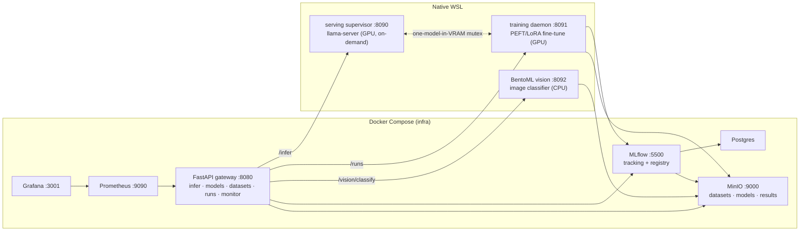

# MLOps-Lite

A lightweight, full-lifecycle MLOps platform that runs **locally on one machine** — data → train →
register → serve → monitor → retrain — built around a single GPU that holds **at most one model at
a time**. A spec-driven (GitHub Spec Kit) reimagining of a heavier reference platform, sized to a
laptop.

> Status: **feature-complete** (001: US1–US5) **+ hardened** (002: auth, secret hygiene, daemon
> supervision, one-command up/down, portable bootstrap). Gateway `v1.2.0`. See
> [`specs/001-mlops-platform/tasks.md`](specs/001-mlops-platform/tasks.md) and
> [`specs/002-hardening/tasks.md`](specs/002-hardening/tasks.md) for per-task detail, and
> [`specs/001-mlops-platform/quickstart.md`](specs/001-mlops-platform/quickstart.md) to run it.

## Architecture

Infrastructure runs in Docker Compose. GPU-bound services (serving, training) run **natively in
WSL** — the *hybrid GPU* model (constitution v1.2.0): the container engine has no NVIDIA runtime,
but the GPU works natively in WSL, so the gateway proxies to native daemons over an injected IP.



**One model in VRAM (Principle II, non-negotiable).** Serving and training mutually exclude on the
GPU: the trainer won't start while a model is resident in serving, and serving won't cold-load
while a training run is active. Serving releases VRAM after an idle timeout.

## Lifecycle & user stories

| Phase | Story | What it does |
|------|-------|--------------|
| 3 | **US1** serve | `POST /infer` → on-demand GPU inference via `llama-server` (VRAM released when idle); `POST /vision/classify` → CPU image classification via BentoML (vision half of FR-002) |
| 4 | **US2** register | `POST /models` + promote via MLflow aliases; `/infer` resolves the promoted version |
| 5 | **US3** datasets | content-addressed, immutable dataset versions on MinIO |
| 6 | **US4** fine-tune | pinned dataset → LoRA on the GPU (Prefect ephemeral) → adapter→GGUF → registered, servable |
| 7 | **US5** monitor | PSI drift → on breach auto-launch a retrain run; Grafana dashboard |

## Run it

See [quickstart](specs/001-mlops-platform/quickstart.md).

**One command (002/US3)** — bring up *everything* (Compose infra + native daemons under the
supervisor + gateway↔daemon IP wiring), and tear it down releasing the GPU:

```powershell
./scripts/gen_secrets.ps1     # once: generate .env (random creds + an API key)
./scripts/up_all.ps1          # infra + supervised daemons + wiring, waits until all reachable
./scripts/down_all.ps1        # stops daemons (no GPU orphans) + infra   (make up-all / down-all)
```

<details><summary>Manual, step-by-step (what up_all automates)</summary>

```bash
./scripts/gen_secrets.ps1                # 002/US1: generate .env (random creds + an API key)
make up                                  # foundational stack
bash serving/llama/run.sh                # WSL: LLM serving supervisor (GPU)
bash training/run.sh                     # WSL: training daemon (GPU, for US4/US5)
~/mlops-train/bin/python scripts/seed_vision_model.py   # one-time: seed the vision model
bash serving/bento/run.sh                # WSL: BentoML vision service (CPU)
./scripts/serve_up.ps1                   # PowerShell: bring up the stack pointed at the daemons
export GATEWAY_API_KEY=mll_...           # 002/US1: the key gen_secrets printed (protected routes)
python tests/test_auth.py && python tests/test_serving.py && python tests/test_registry.py \
  && python tests/test_datasets.py && python tests/test_finetune.py \
  && python tests/test_drift_loop.py && python tests/test_bento.py   # validate each phase
```

</details>

> **Auth (002/US1).** The lifecycle endpoints require an `X-API-Key` header once `GATEWAY_API_KEYS`
> is set (`gen_secrets` provisions one); `/healthz` and `/metrics` stay open. With no key
> configured the gateway runs open and logs a warning. Tests pick up `GATEWAY_API_KEY` from the env.
>
> **Supervisor (002/US2).** Instead of hand-starting the three native daemons, run one process
> supervisor in WSL — it starts serving/training/vision, health-checks them, and restarts any that
> die (exponential backoff). State is at `:8099/status`; the gateway aggregates daemon reachability
> at `/platform/health`.
>
> ```bash
> python3 supervisor/supervise.py     # WSL: supervises the 3 native daemons (replaces the run.sh trio)
> ```

## Default stack (each stage swappable — Principle V)

MinIO (storage) · MLflow (tracking + registry) · `llama.cpp` (LLM serving) · BentoML (vision
serving) · PyTorch + PEFT/LoRA (training, Prefect-structured) · pure-Python PSI (drift) ·
Prometheus + Grafana (observability).

Three components diverge from the plan's first-choice tools, each justified by **Lightweight
Footprint** (Principle III) and **OSS & Swappable** (Principle V), and each isolated behind one
module so it can be swapped back:

| Plan default | Used instead | Why |
|---|---|---|
| DVC | content-addressing on MinIO | DVC needs git + CLI + a commit per version; ill-fitting for an API flow |
| Prefect *server* | Prefect *ephemeral* + native daemon | an always-on server is weight MLflow already covers for run tracking |
| Evidently | pure-Python PSI | Evidently's pandas/scipy/plotly would bloat the gateway image on the constrained Windows C: drive |

## Disk frugality (Principle III)

Container images live on the Windows C: drive (the tight constraint); model/training artifacts
live in WSL (`~`, ample). Keep it lean:

```bash
docker image prune -f          # reclaim dangling images after rebuilds
bash scripts/disk_report.sh    # WSL + Docker disk usage at a glance
```

- Cap the local model zoo (a few small/quantized models); large fp16 weights belong in WSL, not
  in images.
- Optionally relocate the Docker data-root to a larger drive if C: is tight.

## Hardware

Parameterized via [`.specify/memory/hardware-profile.md`](.specify/memory/hardware-profile.md)
(`VRAM_GB`, `RAM_GB`, `FREE_DISK_GB`). Reference machine: RTX 5070 Ti Laptop (12 GB, Blackwell
sm_120), Core Ultra 9 275HX, 31 GB RAM, Win11 + WSL2. To retarget: edit that one file.

## Setup on a new machine (002/US4)

A clean machine of the same shape (Windows 11 + WSL2 + NVIDIA) reaches a passing serving smoke by
**editing only `.specify/memory/hardware-profile.md`** and running the idempotent bootstrap.

**One-time prerequisites** (not automated — driver/toolchain):

- NVIDIA driver on Windows + WSL2 CUDA libraries (so `nvidia-smi` works inside WSL).
- A **CUDA build of `llama.cpp`** for your GPU's compute capability (the reference uses sm_120):
  ```bash
  git clone https://github.com/ggml-org/llama.cpp ~/llama.cpp
  cmake -S ~/llama.cpp -B ~/llama.cpp/build -DGGML_CUDA=ON -DCMAKE_CUDA_ARCHITECTURES=120
  cmake --build ~/llama.cpp/build --config Release -j --target llama-server llama-cli
  ```

**Then** (idempotent — re-runs are a no-op):

```bash
# 1. edit .specify/memory/hardware-profile.md for the new machine (VRAM_GB, etc.)
bash scripts/bootstrap.sh        # WSL: venv + pinned deps (cu128) + GPU gate-zero + seed the LLM
./scripts/gen_secrets.ps1        # PowerShell: generate .env
./scripts/up_all.ps1             # bring the whole platform up
python tests/test_serving.py     # serving smoke (set GATEWAY_API_KEY first)
python tests/test_portability.py # asserts the retarget contract + runs the smoke
```

`bootstrap.sh` automates the venv, the pinned native deps ([`scripts/native_env.lock`](scripts/native_env.lock):
torch/torchvision cu128), the GPU gate-zero check, and the LLM weight download; it **verifies** the
one-time `llama.cpp` CUDA build above (and prints the recipe if missing). See the
[quickstart](specs/001-mlops-platform/quickstart.md) for the per-phase details.

## API

OpenAPI is exported to
[`specs/001-mlops-platform/contracts/openapi.json`](specs/001-mlops-platform/contracts/openapi.json)
and served live at `http://localhost:8080/docs`.
