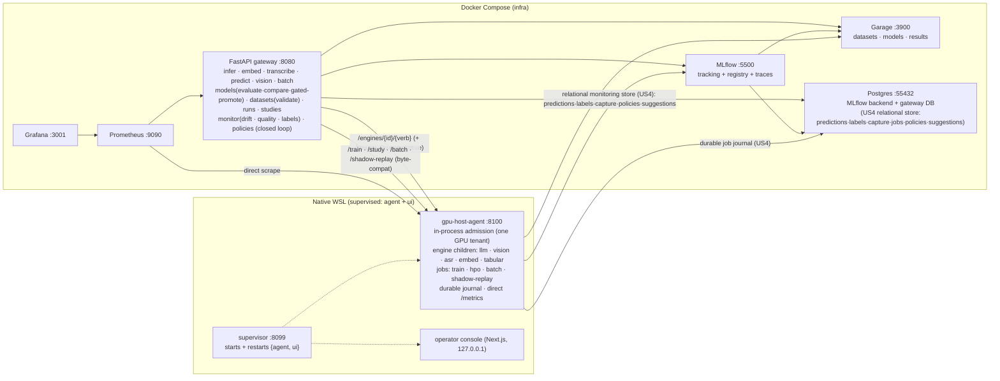

# MLOps-Lite

A lightweight, full-lifecycle MLOps platform that runs **locally on one machine** — data → train →
register → serve → monitor → retrain — built around a single GPU that holds **at most one tenant at
a time under a race-free, in-process admission lock**. A spec-driven (GitHub Spec Kit) reimagining of
a heavier reference platform, sized to a laptop.

> Status: **merged through increment 022; 023 built (offline slice — its [HW] drills are the tail).**
> Five served modalities (LLM text-generation, vision image-classification, embeddings, ASR,
> tabular), a multimodal trainer (LLM + vision + embeddings + ASR fine-tuning with
> lineage/adapter-chaining), a **gated promotion** path (offline eval harness + champion-challenger),
> **Optuna hyperparameter optimization**, **model-quality monitoring** with ground-truth labels,
> **offline batch inference + data-validation gates**, **score-at-registration**, **advisory
> shadow-replay**, **operator-confirmed preemptive swap**, and — since **018** — a consolidated
> **GPU host agent** with in-process admission, shared typed contracts, a closed **declarative
> policy loop** (drift → retrain → gate → promote), and durable **relational monitoring/job state on
> Postgres** (predictions·labels·capture·jobs·policies·suggestions as indexed table reads; landed at
> 018 US4). **020** exited the archived object store to **Garage** and slimmed the serving children;
> **021** added the loop-native operator console; **022** made the LLM **registry-driven** (promote
> = go-live, base + LoRA-adapter resolution, honest served identity). **023
> platform-architecture-hardening** hardens the whole: repaired live-eval routing, a **fail-closed
> internal agent credential** (`X-Agent-Key`), **required CI quality gates**
> (backend·ui·compose·specs), **ordered SQL schema migrations** with a checksummed ledger, a
> **durable/recoverable LLM activation saga** with startup reconciliation, one **bounded stdlib
> agent transport** (worker/queue/body/timeout/shutdown bounds; the dual-runtime switch deleted),
> and **local Prometheus alert rules with runbooks**.
> Constitution `v1.5.2`. Reference stack on MLflow `3.14.0`.
> Architecture ground truth: [current-architecture checklist](docs/current-architecture.md) ·
> [2026-07-11 review](docs/architecture-review-2026-07-11.md) (the
> [2026-07 review](docs/architecture-review-2026-07.md) is historical — its findings are addressed
> through 020–023).
>
> Per-increment detail lives under [`specs/`](specs/) (each has `spec.md` / `plan.md` / `tasks.md`);
> [`specs/001-mlops-platform/quickstart.md`](specs/001-mlops-platform/quickstart.md) is the run guide.

## Architecture

Infrastructure runs in Docker Compose. GPU- and CPU-bound model services run **natively in WSL** —
the *hybrid GPU* model (constitution v1.2.0): the container engine has no NVIDIA runtime, but the
GPU works natively in WSL. Since **018**, all native model work is consolidated behind **one torch-free
`gpu-host-agent` on `:8100`** that owns in-process GPU admission and runs every engine (and every
training/HPO/batch/shadow job) as a supervised **child process** under one shared lifecycle. The
gateway proxies to the agent's single endpoint (`AGENT_URL`).



**One GPU tenant under a single race-free admission lock (Principle II, non-negotiable; constitution
v1.5.0).** At most one tenant holds the GPU at any instant — **LLM**, **vision**, **ASR**, *or* a
**training/HPO/batch/shadow job**. Since **018 (T364)** this is enforced **in-process**: the agent's
`Admission` makes the free-VRAM read, the holder check, and the claim all under one re-entrant lock
(`hostagent/admission.py`) — race-free by construction, no time-of-check/time-of-use window, and no
cross-process lockfile to reclaim. **Live-VRAM admission** prefers NVML (`pynvml`, in-process) and
falls back to a single `nvidia-smi` fork, with a static-budget fallback when the GPU is unreadable
(never fail-open). The same lock makes the preemptive swap transactional. **CPU modalities (embeddings,
tabular) are exempt** — they hold no admission and are never idle-reaped, so RAG embed→LLM never
thrashes.

> The pre-018 file-based lease (`serving/gpu_lease.py`, an atomic PID-stamped lockfile) and the four
> per-daemon supervisors + trainer daemon it coordinated are **retired**. The constitution's Principle
> II mandates a "single, race-free GPU lease / single-slot admission mechanism" — not a specific
> implementation — so in-process admission satisfies it while removing the whole cross-process protocol
> surface.

## Lifecycle, modalities & user stories

| Phase | Story | What it does |
|------|-------|--------------|
| 3 | **US1** serve | `POST /infer` (+`/infer/stream`) → on-demand GPU LLM inference; `POST /vision/classify` → image classification (**GPU tenant** since 008). The gateway proxies these to the agent's `/engines/llm/…` and `/engines/vision/…`. |
| 4 | **US2** register | `POST /models` + promote via MLflow aliases; routing resolves the `@serving` version |
| 5 | **US3** datasets | content-addressed, immutable dataset versions on the object store (Garage) |
| 6 | **US4** fine-tune | pinned dataset → LoRA on the GPU → adapter→GGUF → registered, servable |
| 7 | **US5** monitor | PSI drift → on breach a retrain is launched; Grafana dashboard |

**Served modalities (009 serve · 010 train), all hosted by the agent as engine children:**

| Modality | Serve route | Engine child (adapter) | GPU tenant? | Fine-tune (010) |
|---|---|---|---|---|
| text-generation (LLM) | `/infer` | `llm` — `llama.cpp` | yes (on-demand) | PEFT/LoRA → GGUF (US4) |
| image-classification | `/vision/classify` | `vision` — torch (slim FastAPI child) | yes (on-demand) | transfer-learning head |
| embedding | `/embed` | `embed` — sentence-transformers | **no** (CPU) | sentence-transformers FT |
| asr | `/transcribe` | `asr` — whisper.cpp (opt-in) | yes (on-demand) | Whisper FT → HF→ggml convert |
| tabular | `/predict` | `tabular` — LightGBM | **no** (CPU) | doc-only AutoGluon upgrade path |

> The "GPU tenant?" column is about **serving** — embeddings and tabular serve on CPU and never touch
> admission. **Fine-tuning is different**: *every* fine-tune (all four trainable modalities, embeddings
> included) is the heaviest single GPU tenant — a job acquires admission as `kind="job"` before
> dispatch, so an embedding fine-tune launched while another tenant is resident gets a `409 GPU busy`.
> A GPU job is **structurally non-preemptable** (`NON_PREEMPTABLE_KINDS = {"job"}`) — no probe, no
> fail-open path.

Routing is **registry-metadata-driven for `/infer`** (009): every model version carries a `task` tag
(text-generation / image-classification / embedding / asr / tabular) and a `serving_engine` tag. The
`/infer` path and the serving stage (the pre-021 “Infer tab”) resolve their target off these tags (`resolve_serving_target`), and the
**serving stage renders one panel per `task`** discovered from the registry. The gateway's serving routers
proxy the **byte-compatible** per-engine paths on the agent (`${AGENT_URL}/engines/<id>/…`); a single
`AGENT_URL` replaced the six per-daemon URLs the pre-018 gateway used. Fine-tuned versions (010) land
with the same serving tags **plus lineage** (`base_model`, parent run) so adapters can be chained.
Promotion to `@serving` is **operator-driven** (alias-based) and, since **011**, runs through an
**evaluation gate** (below).

**The LLM is registry-driven too (022).** Pre-022 the `llama.cpp` engine was the sole outlier — it
loaded a fixed GGUF from the `MODEL` env and ignored the registry, so promoting an LLM did nothing.
Now **promote = go live**: promoting a text-generation version from the console moves its
`@serving` alias, records it as the **active serving LLM** (a one-row platform pointer in the
relational store — it spans model *names*, base vs fine-tune), and triggers an **immediate
controlled reload** on the agent (evict → load under admission; displacing a resident serving
model is operator-confirmed; a running job is never preempted — the switch defers instead). At
each cold load the adapter resolves the active model's `@serving` version from the registry:
a `kind=full-model` version serves `-m <gguf>`; a `kind=lora-adapter` fine-tune serves
`-m <base> --lora <adapter>`, with the **base resolved automatically from `base_model` lineage**
to a registered base GGUF (`scripts/register_base_gguf.py` registers the local zoo bases;
an unresolvable/absent base **refuses the promotion** and leaves the served LLM unchanged —
nothing is auto-downloaded). Served identity is **honest end-to-end**: the agent reports the
actually-loaded model + registry version in its health, and `/serving/state`, the `/infer`
response, and every logged prediction consume that agent-reported identity (monitoring windows key
on the model that really produced each output). The `MODEL`/`LORA`/`MODEL_ALIAS` env knobs remain
only as the **fallback default** for when no serving LLM has been selected. Legacy pre-022 LLM
versions are recognized by artifact kind and can be batch-tagged with
`scripts/backfill_llm_task_tags.py` (idempotent, never clobbers an existing tag).

## Run it

See [quickstart](specs/001-mlops-platform/quickstart.md).

**One command (002/US3, updated for 018)** — bring up *everything* (Compose infra + the native agent
and UI under the supervisor + gateway↔agent wiring), and tear it down releasing the GPU:

```powershell
./scripts/gen_secrets.ps1     # once: generate .env (random creds + an API key)
./scripts/up_all.ps1          # infra + supervised {agent, ui} + AGENT_URL wiring, waits until healthy
./scripts/down_all.ps1        # stops the agent (no GPU orphans) + infra   (make up-all / down-all)
```

`up_all` resolves the dynamic WSL IP and sets a **single** `AGENT_URL=http://<wsl-ip>:8100`, writes a
Prometheus file-sd target so the agent is scraped **directly**, brings up Compose, starts the native
daemons under the supervisor (`wsl bash scripts/supervisor_up.sh`), and waits for the gateway's
`/platform/health` to report `all_healthy`. **ASR is opt-in**: whisper.cpp needs a manual CUDA build,
so the `asr` engine reports unavailable (and platform-health treats it as `optional`) until built.

```bash
bash serving/whispercpp/build.sh     # one-time: CUDA whisper.cpp build → the asr engine goes available
```

<details><summary>Manual, step-by-step (what up_all automates)</summary>

```bash
./scripts/gen_secrets.ps1                # 002/US1: generate .env (random creds + an API key)
make up                                  # foundational Compose stack
bash scripts/supervisor_up.sh            # WSL: supervises {agent, ui} on :8099 (health + restart)
./scripts/serve_up.ps1                   # PowerShell: point the gateway at the agent (derives *_URL)
export GATEWAY_API_KEY=mll_...           # 002/US1: the key gen_secrets printed (protected routes)
pytest                                   # validate every phase against the live, keyed stack
```

`serve_up.ps1` is the older manual path — it derives the legacy per-engine vars *from* the agent
(`SERVING_URL=$AGENT_URL/engines/llm`, `TRAINER_URL=$AGENT_URL`, …). Prefer `up_all.ps1`, which sets
only `AGENT_URL`.

</details>

> **Auth (002/US1 + 005/US2 fail-closed; 023/US2 at the agent).** The lifecycle endpoints require an
> `X-API-Key` header once `GATEWAY_API_KEYS` is set (`gen_secrets` provisions one); `/healthz` and
> `/metrics` stay open. **Fail-closed by default (005):** with no key configured protected routes
> return `401` — set `GATEWAY_ALLOW_OPEN=1` for the documented dev escape hatch. **Key rotation needs
> a gateway restart** (FR-046). **The host agent requires its own internal credential (023):**
> `AGENT_API_KEY` (generated by `gen_secrets`; existing installs: `--ensure-agent-key`) — the gateway
> sends it as `X-Agent-Key`, the agent **refuses to start without one** (`AGENT_ALLOW_OPEN=1` is a
> loudly-warned dev-only override), and only the minimal `GET /healthz|/readyz|/metrics` probes stay
> public.
>
> **Network exposure (005/US1).** Every published Compose port and the agent bind to **loopback
> (`127.0.0.1` / `BIND_ADDR`)** by default — nothing answers on the LAN. Set `BIND_ADDR=0.0.0.0` only
> for intentional LAN exposure. The operator console binds `127.0.0.1` only and talks to the gateway
> through a key-injecting BFF (keys never reach the browser).
>
> **Tests (005/US5).** `pytest` is the entry point — it runs the integration suite against a live,
> keyed stack and **skips cleanly** when the stack/key/agent/WSL are absent. Each `tests/test_*.py`
> also runs standalone. The single-tenant admission serializes the GPU tests, so a few GPU-tenant tests
> pass **in isolation** but show as "failures" under the full suite — that is admission working, not a
> regression. The bulk of the agent/admission/lifecycle/journal/jobs suites are **offline, GPU-free**
> (fake adapters + a fake clock).
>
> **Supervisor (002/US2, shrunk at 018).** One process supervisor in WSL starts, health-checks, and
> restarts (exponential backoff) the **two** remaining native daemons — the **agent** and the **UI**.
> It no longer arbitrates the GPU: admission inside the agent is the sole authority. State is at
> `:8099/status`; the gateway aggregates reachability at `/platform/health` (ASR marked `optional`).
> Since 023 it probes the agent's **public minimal `/readyz`** — the rich `/health` is behind the
> internal key.

## Operator console (003 + 004, loop-native since 021)

A Next.js operator console (native WSL, `127.0.0.1`, terminal/man-page aesthetic, JetBrains Mono) sits
over a key-injecting BFF and is itself a supervised daemon. Since **021** the navigation IS the
lifecycle loop — `data → training → models → serving → monitoring → retraining ⟲` — with live
per-stage status glyphs, a persistent off-axis **GPU-lease pill** (holder + resident model), and
`health` off-axis right. `/` lands on `serving`; the old tab paths (`/infer`, `/datasets`, `/runs`,
`/monitor`) redirect to their loop-stage homes. The serving stage renders one panel per registry
`task` (dynamic per-task renderers) plus the full lease view and batch; monitoring gained the
read-side (drift + quality histories, labels by prediction id, one-shot retrain with
cooldown-as-outcome); retraining hosts the standing policy editor (form+JSON), the per-model cycle
board, and the suggestions inbox; models centers the preview→promote gate with lineage drill-back
and override-with-reason. Live updates ride gateway SSE (`/infer/stream`, `/platform/events`,
`/runs/{id}/events`). 004 hardened the BFF (route-allowlist, same-origin/CSRF guard, CSP/security
headers, scoped Grafana embed) and added a `/readyz` probe; 021 extended the allow-list by 13
already-existing endpoints (no backend change).

## Platform re-architecture — the GPU host agent (018)

018 consolidated the four lease-tenant native daemons (llama supervisor, whisper supervisor, BentoML
vision, trainer) plus the two off-lease CPU services and the babysitter's fan-out into **one
torch-free `gpu-host-agent`** — and closed the drift→retrain loop into a declarative policy engine.

- **In-process admission (T364).** The GPU rule is a decision under one re-entrant lock — no lockfile,
  no cross-process protocol, no TOCTOU window (`hostagent/admission.py`). The file lease and its
  migration shim are deleted.
- **One lifecycle, thin adapters (`hostagent/lifecycle.py` + `hostagent/adapters/`).** Load-on-demand →
  ready → drain → idle-release → unload → stuck-child reap lives **once**; each engine is one small
  adapter + one row in the `topology.ENGINES` registry ("a new engine is one adapter + one registry
  row"). Per-engine startup budgets (`ready_wait_s`) and idle timeouts are configurable.
- **Transactional swap (`hostagent/swap.py`).** Evict → free → load runs under an admission
  *reservation* so no third tenant can win the freed slot mid-swap; a running job is refused
  structurally.
- **Durable job journal (`hostagent/journal.py`).** Every job state transition is fsync'd to an
  append-only JSONL log, so a run that took minutes survives an agent restart; non-terminal jobs are
  marked `interrupted` on replay and surfaced, never silently lost.
- **Jobs folded in (T362, `hostagent/jobs.py`).** The trainer's four launch paths (`/train`, `/study`,
  `/batch`, `/shadow-replay`) collapse into one parameterized `JobManager.submit(kind, request)` over
  the single job slot + admission + journal. CUDA isolation is preserved verbatim (fine-tune and
  shadow-replay each run in a fresh `run_flow.py` / `run_shadow.py` subprocess). The agent serves the
  legacy routes **byte-compatibly** (`TRAINER_URL` now points at the agent root, FR-177).
- **Shared typed contracts (`platformlib/`).** `topology` (ports/tenants/engine registry, stdlib-only),
  `contracts` (the `AgentHealth`/`EngineState`/… payload shapes both runtimes exchange, validated), and
  `store` (the shared S3 access helpers).
- **Closed policy loop (US3).** Declarative per-model policies (API + UI editor) drive scheduled checks
  → modality-correct retrain on the latest dataset → the 011 gate → `manual` / `suggest` /
  `auto-on-green` promotion (consuming 016 shadow verdicts). The scheduler is a **gateway-lifespan
  asyncio task** — no new resident service. `POST/GET/PUT/DELETE /policies`.
- **Direct metrics.** The agent exposes Prometheus `/metrics` scraped directly (no per-poll subprocess
  forks); NVML replaces per-call `nvidia-smi`.

New deps are minimal: `pynvml` (in-process NVML, host-only) and `psycopg` (the relational client, in
the gateway + agent images). **Relational monitoring store (018 US4, landed).** The high-churn state
(predictions, labels, captured-input index, jobs, policies, suggestions) lives on the already-resident
`gateway` Postgres DB as indexed table reads (`platformlib.store`); since **023 US4** its schema is
owned by **ordered, checksummed SQL migrations** (`platformlib/migrations/`, applied by the gateway at
startup — see below). No broker, no scheduler framework, no ORM. The frozen GPU stack is untouched.

## 018 review remediation (019)

A high-effort review of the 018 fold-in found ten defects; **019** fixes all of them, each with a
regression test: journal torn-tail durability + durable-before-memory ordering, admission self-recovery
after a dropped release, a swap target-probe that refuses before evicting on a non-2xx target,
**idempotent retrain launches** (a stable key deduped by the agent's `JobManager` so a lost response or
store blip never starts a duplicate GPU job), a lifecycle load/unload admission race, single-flight swap
reservations, `/health` + `/engines` conformance to the `platformlib.contracts` shapes, per-engine
startup/idle budgets, and deterministic shadow-verdict selection. Remediation only — no new capability;
Principle II is *strengthened*, never weakened.

## GPU admission & vision-on-GPU (008, now in the agent)

008 generalized Principle II from "one LLM in VRAM" to **one GPU tenant** and moved vision onto the GPU.
The mechanism has since moved from a file lease into the agent's in-process admission (018/T364), but
the guarantees are the same:

- **Admission** — `hostagent/admission.py`: one re-entrant lock; live-VRAM check (NVML → `nvidia-smi` →
  static budget); idempotent re-affirm for the current tenant; a swap reservation for transactional
  evict→load. The gateway only *reads* the current holder for the UI status line.
- **Vision-on-GPU** — the vision engine child loads its classifier to `cuda` as a tenant and holds the
  slot across load+inference; it refuses (gateway `409`) while another tenant holds the GPU.
- **Serving stage** (pre-021: the Infer tab) shows a read-only `serving:` status line; `classify` is disabled-with-hint while the GPU
  is held — or offers **Swap & classify** (017) when the holder is another serving model.

## Swap-on-demand (017 — 008's A2 fast-follow)

008 shipped admission as **cooperative refuse-if-held** (`409 GPU busy`). 017 adds an
**operator-confirmed preemptive swap for serving models**: a serving request (`/infer`, `/infer/stream`,
`/vision/classify`, `/transcribe`) may carry an explicit **`preempt: true`**; when a *serving* model is
resident, the resident model is **evicted and the target loaded** — a single sequential swap, **one
model in VRAM throughout**.

- **Transactional in the agent (018)** — `hostagent/swap.py` holds an admission *reservation* across
  evict→free→load so no contender can snipe the freed slot; the gateway's `preempt=true` flows to the
  agent (`?preempt=true`, and an opt-in `POST /control/unload`). (Pre-018 this was gateway-brokered over
  each daemon's `unload-now`; that path retired with the daemons.)
- **Training is never preempted** — a `preempt=true` request against a training/HPO/batch holder is
  **refused** (`409`); a GPU job is structurally non-preemptable.
- **Default is byte-for-byte 008** — with `preempt` omitted/false, behavior is unchanged refuse-if-held.
- **UI** — the serving stage’s `classify` "GPU busy" dead-end becomes a cost-stating **"Swap & classify"**
  confirm; a training holder keeps the disabled hint.

## Evaluation gates (011)

Before 011, `promote(name, version)` moved the `@serving` alias with no check the new version was better.
011 adds the connective tissue, wired into the **single `registry.promote` choke-point** (the
`scripts/seed_*` bootstrap scripts are explicit, documented gate exceptions for initial seeding):

- **Offline eval harness** (`gateway/app/evaluation.py`) scores a version on a small **held-out
  benchmark** under [`benchmarks/`](benchmarks/) and logs the primary metric to MLflow. Each metric
  carries a **direction**; metrics are **pure-Python** (no `numpy`/`scipy`/`jiwer` — Principle III);
  every `EvalResult` records the benchmark's name + SHA-256 digest for provenance.
- **Promotion gate** compares the candidate against the `@serving` incumbent honouring metric direction
  and like-for-like. **Default = BLOCK** a regression beyond a small tolerance; an operator **override**
  bypasses a block, and a config switches to **warn-on-regression**. No incumbent ⇒ pass.
- **Offline champion-challenger** declares a winner from both versions' **logged metrics** (015 — no
  model reload).

```bash
curl -X POST localhost:8080/models/<name>/evaluate -H "X-API-Key: $KEY" -d '{"version":"1"}'
curl -X POST localhost:8080/models/<name>/compare  -H "X-API-Key: $KEY" -d '{"challenger":"2"}'
# POST /models/<name>/promote is gated — body {"version":"N","override":true} bypasses a block.
```

## Score-at-registration (015 — closes SC-068)

015 makes every fine-tuned version **born with its eval metric**: each fine-tune scores its own model
in-process at registration, inside its existing GPU hold (`training/scoring/`), and logs the primary
metric on the new version. The gate, `compare`, quality, and the HPO objective read those logged
metrics — no serving reload, no per-version loading machinery. All four trainable modalities ship a
content-hashed held-out fixture under [`benchmarks/`](benchmarks/). Gateway `/evaluate` is guarded
(FR-143): a non-`@serving` version with no logged metric is refused with a clear `409` — never a silent
score of the wrong (resident) model.

## Hyperparameter optimization (012)

012 wraps the trainer in an **Optuna** study (`training/flows/hpo.py`) that optimizes toward 011's eval
metric. A study runs N trials, each a real fine-tune recorded as an MLflow **child run**; the best trial
is registered as a version eligible for the 011 gate. Optuna is pure-Python and server-less. Because
each trial is a GPU job, **trials run strictly sequentially** — total wall-clock = `n_trials ×
per-train-time`.

```bash
curl -X POST localhost:8080/studies -H "X-API-Key: $KEY" \
  -d '{"dataset_name":"qa-demo","dataset_version":"1","output_name":"qa-hpo","modality":"llm","n_trials":3}'
curl localhost:8080/studies/<study_id> -H "X-API-Key: $KEY"     # study status + best trial
```

## Quality monitoring with ground truth (013)

The 001 monitor watches only the **input** side (pure-Python PSI over feature distributions). 013 adds
**output/concept-drift** monitoring against ground truth:

- **Prediction logging** — every served prediction is logged fire-and-forget / fail-open with a stable
  id + resolved version, landing in the `results` store.
- **Delayed labels** — `POST /monitor/labels` attaches ground-truth labels when known; `data/submit_labels.py`
  drives it.
- **Windowed quality** — `POST /monitor/quality/check` computes per-modality quality over a window,
  compares it to a like-for-like baseline, and on a breach fires the retrain trigger (OR-combined with
  input drift, with a cooldown) — now orchestrated by the 018 policy loop. `GET /monitor/quality` lists
  reports; the Grafana dashboard carries the quality series.

## Shadow-replay champion-challenger (016 — advisory)

011's `compare()` judges a challenger on a fixed benchmark; **016** judges it on the **real traffic the
champion served**. It is **advisory** — it never gates promotion. Scope = LLM / vision / ASR.

- **Recoverable input capture** — 013's logging is extended (behind `QUALITY_CAPTURE_IO`, under a
  sampled + capped + TTL policy) to store the recoverable served input under `inputs/<modality>/`.
- **`POST /models/{name}/shadow-replay {challenger}`** dispatches an async agent-side job that loads the
  challenger under the single GPU tenant and scores it over the **captured ∩ labeled** window; the
  champion is not re-run. It persists an advisory per-metric verdict (`results` `shadow/` prefix);
  `GET /models/{name}/shadow-replay/{id}` returns it.
- **Honest degradation** — too few pairs → `insufficient_data`; capture disabled → `no_corpus`; no
  captured inputs → a clear refusal.

## Batch inference & data-validation gates (014)

- **Offline batch inference** — `POST /batch` (+ `GET /batch/{batch_id}`) scores a registered dataset
  version against a served model as an ephemeral flow on the agent (`training/flows/batch_infer.py`),
  writing content-addressed results to the object store. A GPU-backed batch goes **through admission** as a job;
  CPU/tabular batches score off-lease.
- **Data-validation gates** — lightweight hand-rolled checks (schema/columns, null rate, value ranges,
  label balance, row count) gate `finetune_flow` **before** `train_lora`, and are exposed advisory via
  `POST /datasets/{name}/{version}/validate`. Not Great Expectations / pandera (Principle III).

## Inference traces (006, on MLflow 3.x since 007)

Every `POST /infer` and `/infer/stream` emits one **MLflow trace** (prompt, params, output,
`load_ms`/`infer_ms`, model, `usage`, `registry_version`, status) into the **`mlops-lite-inference`**
experiment. Manual (not autolog — the gateway proxies over `httpx`); *fire-and-forget* + *fail-open* so
it never slows or blocks inference. Toggles: `MLFLOW_TRACING_ENABLED=0`, `MLFLOW_TRACE_CAPTURE_IO=0`.

## Stack remediation (020 — BUILT)

020 turned the 2026-07 post-018 tech-stack review into action. Nine of eleven layers got keep-verdicts;
the three approved items all landed, validated on hardware (runbook records in `docs/`):

1. **Object-store exit (P1, done)** — the archived-upstream store was replaced by **Garage** (v2.3.0,
   digest-pinned; ~24× lighter at idle): spike-gated, migrated losslessly (540 objects, per-bucket
   parity, idempotent re-runs), cut over by config flip with a PROVEN rollback, then decommissioned —
   the running stack contains zero unmaintained components (SC-129: `docker compose config` and a
   source-tree grep both return zero live references to the retired store).
2. **"Bento-ectomy" (P2, done)** — the serving framework left the vision/embed/tabular children for
   slim single-route FastAPI services, gated by per-child golden request/response sets replayed
   **byte-identical** at the agent boundary; the framework + 20 exclusive transitive deps left the
   venv (216 → 195 packages), model runtimes unchanged.
3. **Agent HTTP runtime (P2, decided)** — the on-hardware drill measured both transports under the
   agent's real duties (stream TTFT/stalls under polling, multipart RTT, mid-stream disconnect,
   preempt-during-stream): **verdict `keep-stdlib`** — equivalent within noise; the dual-runtime
   switch is deleted next increment.

No new capability, no new resident service, no new data shape; every externally observable behavior
was preserved (goldens, suite, and golden flows pass unchanged).

## Platform architecture hardening & delivery integrity (023 — BUILT, offline slice)

023 turned the [2026-07-11 architecture review](docs/architecture-review-2026-07-11.md) into seven
independently testable hardening stories — no new resident service, no new GPU tenant:

- **Routing integrity (US1).** The last executable pre-018 endpoints (live-eval's `:8090`/`:8092`
  defaults) now derive from the consolidated agent topology; a repo guard
  (`scripts/check_specs.py`) fails CI if a retired daemon port re-enters executable routing.
- **Agent trust boundary (US2).** Network locality is not authorization: every inference/job/
  control route on the agent requires the generated internal `AGENT_API_KEY` (constant-time
  compare, auth before any body read or side effect, stable 401/403). Public = exactly
  `GET /healthz|/readyz|/metrics`.
- **Required delivery gates (US3).** `.github/workflows/quality.yml` runs `backend` (Ruff + full
  offline pytest + an ephemeral-Postgres migration suite), `ui` (`npm ci` + ESLint + production
  build), `compose` (config render with non-secret CI values), and `specs` (artifact/ID/
  placeholder/story consistency + the retired-port guard) on every PR. Locally: `make lint test
  ui-check compose-check spec-check` — the same commands.
- **One migration history (US4).** `platformlib/migrations/*.sql` (ordered, immutable, SHA-256
  checksummed) is the only schema authority; the gateway applies at startup under a Postgres
  advisory lock and fails readiness on error; agents/tools verify compatibility and never evolve;
  legacy databases are adopted idempotently with exact shape verification.
  `python scripts/migrate_db.py status|apply` is the operator surface.
- **Recoverable LLM activation (US5).** A promote's pointer-write → keyed agent reload →
  verify/rollback runs as ONE durable `ActivationOperation` (compare-and-set transitions, one
  non-terminal op platform-wide, agent-side idempotent replay by `operation_id`). A crash at any
  step reconciles from gateway startup; `GET /serving/llm/activation` (and the serving page) shows
  desired vs resident honestly — incomplete desired state is never labeled serving.
- **Bounded agent transport (US6).** One stdlib transport (the 020 drill's keep-stdlib verdict
  executed — `hostagent/asgi.py` deleted): bounded workers + queue (minimal 503 beyond), 1 MiB
  JSON / 32 MiB multipart body caps enforced before buffering (counted chunked reads), per-socket
  IO timeouts, graceful drain + child-unload on SIGTERM.
- **Actionable operations (US7).** Fixed-cardinality outcome/latency metrics on both planes and
  [local Prometheus alert rules](infra/prometheus/rules/mlops-lite.yml) (wedged engine, degraded
  activation, failed migration, saturation, low disk, …) — each with a runbook in
  [monitoring/README.md](monitoring/README.md). No Alertmanager.

## Default stack (each stage swappable — Principle V)

Garage (storage) · MLflow `3.14.0` (tracking + registry + traces) · `llama.cpp` (LLM serving) · slim
FastAPI children / torch (vision) · sentence-transformers (embeddings, CPU) · LightGBM (tabular, CPU) ·
whisper.cpp (ASR serving) · PyTorch + PEFT/LoRA (training, Prefect-structured) · Optuna (hyperparameter
search) · pure-Python PSI (input drift) + pure-Python eval/quality metrics + hand-rolled data validation ·
Prometheus + Grafana (observability) · a stdlib-only host agent (`pynvml` for NVML). Postgres backs
MLflow and hosts the relational monitoring/job store (018 US4) under ordered SQL migrations (023 US4).

Three components diverge from the plan's first-choice tools, each justified by **Lightweight Footprint**
(III) and **OSS & Swappable** (V):

| Plan default | Used instead | Why |
|---|---|---|
| DVC | content-addressing on the object store | DVC needs git + CLI + a commit per version; ill-fitting for an API flow |
| Prefect *server* | Prefect *ephemeral* + host agent | an always-on server is weight MLflow already covers |
| Evidently | pure-Python PSI | Evidently's pandas/scipy/plotly would bloat the gateway image on the constrained C: drive |

**Frozen GPU stack (NON-NEGOTIABLE).** The Blackwell sm_120 pins — `torch+cu128`, `torchvision+cu128`,
and the fine-tune libraries (`transformers`/`peft`/`accelerate`/`datasets`) — are validated against the
GPU and the LoRA→GGUF pipeline and are **not** churned by stack refreshes. 007 modernized everything
*around* them (MLflow 2.18→3.14, pinned infra images by digest, gateway on `python:3.12`, UI on Next
15 / React 19); 018 added `pynvml`/`psycopg` (host-only) and left the GPU stack untouched.

## Disk frugality (Principle III)

Container images live on the Windows C: drive (the tight constraint); model/training artifacts live in
WSL (`~`, ample).

```bash
docker image prune -f          # reclaim dangling images after rebuilds
bash scripts/disk_report.sh    # WSL + Docker disk usage at a glance
```

- Cap the local model zoo (a few small/quantized models); large fp16 weights belong in WSL, not images.
- Optionally relocate the Docker data-root to a larger drive if C: is tight.

## Hardware

Parameterized via [`.specify/memory/hardware-profile.md`](.specify/memory/hardware-profile.md)
(`VRAM_GB`, `RAM_GB`, `FREE_DISK_GB`). Reference machine: RTX 5070 Ti Laptop (12 GB, Blackwell sm_120),
Core Ultra 9 275HX, 31 GB RAM, Win11 + WSL2. To retarget: edit that one file. (020 reaffirms the GPU
budget stays fully parameterized so a 12 GB → 16 GB move is config-only.)

## Setup on a new machine (002/US4)

A clean machine of the same shape (Windows 11 + WSL2 + NVIDIA) reaches a passing serving smoke by
**editing only `.specify/memory/hardware-profile.md`** and running the idempotent bootstrap.

**One-time prerequisites** (driver/toolchain — not automated):

- NVIDIA driver on Windows + WSL2 CUDA libraries (so `nvidia-smi` works inside WSL).
- A **CUDA build of `llama.cpp`** for your GPU's compute capability (reference: sm_120):
  ```bash
  git clone https://github.com/ggml-org/llama.cpp ~/llama.cpp
  cmake -S ~/llama.cpp -B ~/llama.cpp/build -DGGML_CUDA=ON -DCMAKE_CUDA_ARCHITECTURES=120
  cmake --build ~/llama.cpp/build --config Release -j --target llama-server llama-cli
  ```
- *(Optional, for ASR)* a CUDA build of **whisper.cpp** — `bash serving/whispercpp/build.sh`.

**Then** (idempotent — re-runs are a no-op):

```bash
# 1. edit .specify/memory/hardware-profile.md for the new machine (VRAM_GB, etc.)
bash scripts/bootstrap.sh        # WSL: venv + pinned deps (cu128) + GPU gate-zero + seed the LLM
./scripts/gen_secrets.ps1        # PowerShell: generate .env
./scripts/up_all.ps1             # bring the whole platform up (agent + ui + infra)
python tests/test_serving.py     # serving smoke (set GATEWAY_API_KEY first)
python tests/test_portability.py # asserts the retarget contract + runs the smoke
```

`bootstrap.sh` automates the venv, the pinned native deps
([`scripts/native_env.lock`](scripts/native_env.lock): torch/torchvision cu128 + the modality deps + the
agent's `pynvml`/`psycopg`), the GPU gate-zero check, and the LLM weight download; it **verifies** the
one-time `llama.cpp` CUDA build (and prints the recipe if missing).

**Every knob a different-GPU machine needs (020 US4, FR-207/SC-133)** — configuration only, zero
code edits:

| Knob | Where | Notes |
|---|---|---|
| `VRAM_GB` | `.env` (via `hardware-profile.md` + `bootstrap.sh`) | The GPU budget. ONE default lives in `platformlib.topology.vram_budget_gb()`; live NVML reads stay primary, the static fallback refuses above `VRAM_GB × 0.95`. Model-size estimates (`*_EST_GB`) are env-tunable beside it. |
| Native builds | `~/llama.cpp` (cmake, set `CMAKE_CUDA_ARCHITECTURES` to YOUR sm), `bash serving/whispercpp/build.sh` | Per-GPU compute capability — the one-time prerequisites above. |
| CUDA wheels | `scripts/native_env.lock` (torch/torchvision `cu128` index) | A different CUDA generation may need a different index; `bootstrap.sh` installs from the lock. |
| Secrets | `./scripts/gen_secrets.ps1` (or `.sh`) | Fresh `.env` incl. the Garage RPC/admin secrets; the Garage S3 pair records post-bootstrap via `--record-garage`. |
| Renamed host | nothing | The agent's state dir + beacon are host-name independent (`MLOPS_STATE_DIR`, fixed); a renamed WSL host self-heals when idle (018 FR-166). |

## API

OpenAPI is exported to
[`specs/001-mlops-platform/contracts/openapi.json`](specs/001-mlops-platform/contracts/openapi.json)
and served live at `http://localhost:8080/docs`.

## Increment history

| # | Increment | What it added |
|---|---|---|
| 001 | mlops-platform | Full lifecycle: serve · register · datasets · LoRA fine-tune · drift→retrain |
| 002 | hardening | Auth + secret hygiene, native-daemon supervisor, one-command up/down, portable bootstrap |
| 003 | frontend | Next.js operator console over a key-injecting BFF |
| 004 | hardening | BFF allowlist + CSRF/CSP, `/readyz`, Node-gated bootstrap |
| 005 | hardening | Loopback-bind all ports, fail-closed auth, CLI/BFF origin guards, pytest convert |
| 006 | inference-tracing | Manual MLflow traces on `/infer` (fire-and-forget, fail-open) |
| 007 | stack-refresh | MLflow 2.18→3.14, pinned infra images, gateway `python:3.12`, UI Next/React bumps (GPU stack frozen) |
| 008 | gpu-lease | Race-free single GPU lease + vision-on-GPU; constitution v1.4.0 |
| 009 | inference-modalities | Registry task/engine routing + embeddings · ASR · tabular serving + task-driven Infer tab |
| 010 | multimodal-finetune | Vision · embeddings · ASR fine-tuning + lineage/adapter-chaining |
| 011 | evaluation-gates | Offline eval harness + gated promotion + offline champion-challenger |
| 012 | hyperparameter-optimization | Optuna study over the fine-tune path, optimizing 011's eval metric |
| 013 | quality-monitoring | Prediction + ground-truth logging → windowed quality → breach-retrain |
| 014 | batch-and-validation | Offline batch inference + pre-training data-validation gates |
| 015 | on-demand-version-loading | Score-at-registration: every fine-tune logs its eval metric in-process; gate/compare/HPO read logged metrics; `/evaluate` guard (closes SC-068) |
| 016 | shadow-replay | Production-traffic champion-challenger: bounded recoverable-input capture + advisory verdict (never gates) |
| 017 | swap-on-demand | Operator-confirmed preemptive GPU swap for serving (`preempt=true`; training never preempted; default = 008 refuse-if-held) |
| 018 | platform-rearchitecture | GPU host agent (in-process admission, T364), one lifecycle + thin adapters, transactional swap, durable job journal, jobs fold-in (T362), shared `platformlib` contracts, closed declarative policy loop; constitution v1.5.0 |
| 019 | review-remediation-018 | Ten verified fixes to the 018 fold-in: journal durability, admission self-recovery, swap target-probe, idempotent retrains, lifecycle race, single-flight swap, contract conformance, per-engine budgets, deterministic verdict selection |
| 020 | stack-remediation | **Built + [HW]-validated** — object-store exit (→ Garage; decommissioned), "Bento-ectomy" (byte-identical golden gates; venv 216→195), agent-runtime verdict keep-stdlib; no new capability |
| 021 | loop-native-console | Front-end-only IA rebuild: the nav IS the loop (`data → training → models → serving → monitoring → retraining ⟲`) with live stage badges + GPU-lease pill; monitoring read-side, retraining stage (policies/cycle board/suggestions), promote-gate centerpiece, LLM stream/trace split; 13 allow-list additions, zero backend change |
| 022 | registry-driven-llm-serving | Promote = go-live for the LLM: ActiveServingLLM pointer, base + LoRA-adapter resolution from registry lineage, controlled reload under admission, honest agent-reported served identity (offline slice + two on-HW fixes; the switch drills are the [HW] tail) |
| 023 | platform-architecture-hardening | **Built (offline slice)** — live-eval routing repair + retired-port guard, fail-closed internal agent credential, required CI gates (backend·ui·compose·specs) + Makefile parity, ordered checksummed SQL migrations (gateway-owned apply, legacy adoption), durable LLM activation saga + startup reconciliation + desired/resident read model, bounded stdlib agent transport (asgi deleted), fixed-cardinality metrics + local alert rules with runbooks, constitution v1.5.2 wording amendment; [HW] drills (T517/T528/T536/T555-T557) are the tail |
