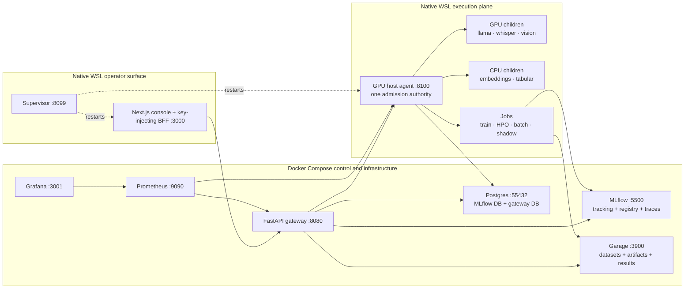
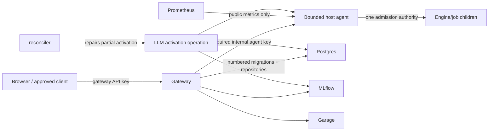

# MLOps-Lite Architecture Review — Post-021 Baseline

**Reviewed**: 2026-07-11
**Repository baseline**: `42f8c6e` (`master`, 022 specification merged; 022 implementation not started)
**Scope**: control plane, host agent, engine children, training jobs, state and artifact stores,
operator console, observability, delivery workflow, and the active 022 design
**Method**: code and configuration inspection, comparison with the constitution and 001–022
specification history, targeted core-agent tests, and inspection of the current GitHub workflows

This review supersedes the implementation snapshot in
[`docs/architecture-review-2026-07.md`](./architecture-review-2026-07.md). That earlier review is
still valuable as decision history, but it describes the pre-018 multi-daemon system. Most of its
major recommendations were subsequently implemented by 018–021.

## Executive verdict

MLOps-Lite is architecturally sound for its intended operating model: one operator, one local
machine, one constrained GPU, and no required cloud services. Its strongest decision is the
consolidated GPU host agent: one process owns admission while model runtimes and long-running jobs
remain isolated as supervised children. The platform should continue as a modular single-node
system. Kubernetes, a broker, Redis, a resident workflow server, and multi-replica control-plane
design would add more failure modes than value.

The re-architecture also changed the risk profile. The central GPU invariant is stronger, but the
host agent is now a privileged internal API and must be treated as a real security boundary. The
platform has extensive tests but no automated test workflow. Its operational schema is useful but
has no real migration history. Finally, the LLM is still the only serving engine whose actual
artifact is selected outside the registry; 022 correctly targets that gap, but its activation
sequence spans MLflow, Postgres, and the agent and therefore needs explicit recovery semantics.

### Priority summary

| Priority | Recommendation | Outcome |
|---|---|---|
| P0 | Repair stale live-evaluation URLs | Evaluation reaches the consolidated agent, not retired ports |
| P0 | Make the host-agent API fail-closed | Direct agent access cannot bypass gateway policy |
| P0 | Add reproducible CI and a declared test environment | Every PR proves offline backend and UI integrity |
| P1 | Implement 022 activation as a recoverable operation | Alias, pointer, and resident model converge after partial failure |
| P1 | Replace duplicated bootstrap DDL with numbered migrations | Fresh installs and upgrades use one schema history |
| P1 | Keep one bounded agent transport | Smaller attack surface and deterministic resource use |
| P2 | Split code hotspots inside existing process boundaries | Lower change coupling without new services |
| P2 | Add alert rules and operation metrics | Failures become actionable locally |
| P2 | Maintain one authoritative current-state document | Operators do not infer present behavior from historical specs |

## Architecture as built

### Architectural approaches

#### 1. Modular control-plane monolith

The FastAPI gateway is the authenticated control plane. Routers separate serving, datasets,
training, registry, monitoring, validation, batch, and policy operations, while domain modules own
evaluation, quality, scheduling, and registry behavior. Keeping these capabilities in one process
is appropriate for the one-operator scale and allows the declarative policy scheduler to run as a
gateway lifespan task without another service.

The cost is growing internal coupling. `gateway/app/quality.py`, `evaluation.py`, and
`scheduler.py` are now large change hotspots. The right response is internal module extraction and
characterization tests, not service decomposition.

#### 2. Host-agent execution plane with child isolation

The host agent owns the single-GPU invariant in process. Admission checks live VRAM and holder state
under one re-entrant lock. Lifecycle management is shared across engine adapters. Swap holds a
reservation across evict → free → load, while jobs are structurally non-preemptable. CPU-only
engines share the same lifecycle surface but do not acquire GPU admission.

This is a good application of a host-agent pattern: hardware policy is centralized, while model
runtimes stay replaceable and crash-isolated as children. It also gives the gateway one stable
endpoint rather than a topology of modality-specific daemons.

#### 3. Ports-and-adapters integration

`platformlib.topology` centralizes engine identities and the agent URL. `platformlib.contracts`
provides additive typed payloads shared by gateway and agent. Runtime-specific behavior sits behind
thin adapters, and model/evaluation code uses injected functions in tests. This keeps the core
testable without a GPU or live infrastructure.

Some transition-era exceptions remain. Most importantly, the standalone-loaded live evaluation
predictors still use retired daemon defaults instead of deriving their paths from the shared agent
topology.

#### 4. Purpose-specific persistence

The current data ownership is coherent:

| State | Authority | Reason |
|---|---|---|
| Experiments, runs, registry versions, aliases, traces | MLflow on Postgres | Established ML lifecycle and registry semantics |
| Predictions, labels, captures, jobs, policies, suggestions | `gateway` Postgres database | Indexed, joined, write-once, restart-safe operational state |
| Dataset payloads, model artifacts, reports and results | Garage S3 | Immutable/blob-oriented content |
| Agent transition recovery | Postgres job rows plus append-only host journal | Durable state with local crash evidence |
| Actual resident engine/model identity | Host agent | Only the execution owner can report what is really loaded |

The weakness is schema evolution. `platformlib/store.py` and `infra/postgres/init.sql` duplicate the
same DDL. Additive changes are applied opportunistically while `SCHEMA_VERSION` remains `1`; the
version is recorded but not used as a migration ledger or compatibility gate.

#### 5. Declarative feedback loop without a broker

Policies persist their schedule, pending retrain, current watch, and promotion outcome in Postgres.
The gateway scheduler performs due monitoring checks, launches modality-correct retraining with a
stable idempotency key, parks a queue-of-one retry while the GPU is busy, evaluates completed runs,
and applies manual, suggest, or auto-on-green promotion behavior. This is a strong lightweight
alternative to adding a broker or resident workflow service.

The scheduler deliberately assumes one gateway process. That assumption should remain explicit;
multi-replica scheduling is outside the platform scope.

#### 6. BFF-secured local operator console

The Next.js BFF owns the gateway API key, applies a route allow-list and same-origin checks, and
keeps secrets out of browser JavaScript. Navigation follows the lifecycle loop rather than backend
subsystems. This is a good local-console pattern.

The trust boundary currently ends too early. The gateway is fail-closed, but the agent binds to all
interfaces so containers can reach it, and its control secret is optional. Direct callers can reach
agent inference/job routes without passing gateway authentication, and control routes become open
when no secret is configured.

#### 7. Spec-driven, hardware-gated delivery

The repository has 22 increment histories, 81 Python test modules, and 480 test functions. Offline
tests use fakes and skip guards; target-hardware quickstarts validate GPU invariants that CI cannot.
This combination is appropriate.

The missing link is enforcement: GitHub Actions currently runs AI-assisted review but no automated
backend tests, lint, dependency installation, Compose validation, or UI build. A large test suite
that is not a required PR check is advisory rather than a delivery gate.

## Findings and recommendations

### P0. Live evaluation still targets retired daemons

`gateway/app/evaluation.py` defaults the LLM predictor to
`http://host.docker.internal:8090` and the vision predictor to `:8092`. Those daemons retired in
018. Compose now injects only `AGENT_URL`, so the default live-evaluation path can fail even while
ordinary inference is healthy.

**Recommendation**: derive `AGENT_URL` through `platformlib.topology`, append
`/engines/llm` or `/engines/vision`, preserve explicit test overrides, and add a regression test
that asserts no retired port appears in executable routing code.

### P0. The host-agent trust boundary is fail-open

The agent defaults to `0.0.0.0`. `AGENT_CONTROL_SECRET` is optional, and the conditional checks mean
missing configuration disables authorization. Inference and job submission have no agent-level
authentication because the design assumes all traffic arrives through the gateway.

**Recommendation**: introduce one generated internal agent key. All routes except explicitly public
health/readiness/metrics probes require it. Startup fails when it is absent unless an explicit
`AGENT_ALLOW_OPEN=1` development override is set and prominently logged. Gateway and approved host
tools inject the key; the BFF continues to use the separate gateway API key. Never expose either key
in response bodies, metrics, process arguments, or logs.

### P0. Delivery gates are not automated or reproducible

The checked-in workflows do not execute the test suite. The root project metadata declares no test
dependencies. On the review host, full pytest collection stopped because `prometheus_client` and
`boto3` were absent, while the UI build could not execute the WSL-created `next` binary from the
Windows shell.

**Recommendation**: provide one documented offline developer/CI setup, then require Ruff, offline
pytest, `npm ci`, UI build/type-check, Compose configuration validation, and spec consistency on
pull requests. Keep GPU and live-stack tests in a separate, manually recorded hardware gate. CI
must not install the CUDA training stack or download model weights.

### P1. 022 activation needs recoverable multi-system semantics

Increment 022 correctly makes the LLM registry-driven and makes promotion the go-live action. That
action will update an MLflow alias, a Postgres active-model pointer, and the model resident in the
host agent. No transaction can atomically cover all three.

**Recommendation**: persist an activation operation with previous and target identity, serialize
operations, validate artifacts before state mutation, make every step idempotent, distinguish
desired from actually resident identity, and reconcile incomplete operations after process restart.
On failure, attempt rollback to the previous pointer/alias and keep the previous resident model. If
rollback itself fails, surface a degraded state rather than claiming success or silently guessing.

### P1. Bootstrap DDL is not a migration system

Fresh initialization and runtime bootstrap carry separate copies of the schema. The version marker
does not track additive changes or prevent a newer binary from running against an older schema.

**Recommendation**: use ordered, forward-only SQL migrations with version, checksum, and timestamp;
serialize migration application with a Postgres advisory lock; run migrations from the gateway
startup path; make other processes check compatibility; and reduce `init.sql` to database creation.
Use expand/contract changes for destructive evolution and require a backup/restore drill before the
first migration is applied to a populated installation.

### P1. The agent has two transports and unbounded request edges

The 020 hardware verdict selected the stdlib server, but the uvicorn transport remains. The stdlib
handler creates request threads through `ThreadingHTTPServer` and reads the caller-provided
`Content-Length` without a maximum. Keeping two transports doubles contract and streaming tests.

**Recommendation**: retain the measured stdlib transport, remove the ASGI alternative, add bounded
concurrency, endpoint-specific body limits, socket timeouts, graceful shutdown, and request outcome
metrics. Preserve the engine lock across a stream and the existing single-GPU admission invariant.

### P2. Internal modules are becoming change hotspots

The largest production modules combine persistence, orchestration, transport, and domain rules.
This does not justify new services, but it increases review surface and makes unrelated changes
collide.

**Recommendation**: after characterization tests, split repositories from domain calculations,
scheduler state transitions from external adapters, evaluation metrics from live predictors, agent
routing from transport, and large UI pages into hooks and panels. Keep public APIs and process
boundaries unchanged.

### P2. Metrics exist, but failures are not actionable

Prometheus directly scrapes the host agent, closing the old gateway observability single point of
failure. There are still no alert rules, and agent metrics emphasize current gauges over operation
outcomes.

**Recommendation**: add counters and latency histograms for admission, swap/reload, request, job,
scheduler, database, and store outcomes. Add Prometheus rules for a wedged engine, long-held tenant,
repeated policy failure, low disk, migration failure, and unavailable Postgres/Garage. Rules and
Grafana panels are sufficient; do not add Alertmanager unless an external notification requirement
appears.

### P2. Current-state documentation drifts behind implementation

The README says the repository is merged through 020 although 021 is merged and 022 is specified.
It also labels relational-store work as in progress after the write paths landed. Historical
transition text mentions retired BentoML and daemon arrangements in present-tense sections.

**Recommendation**: make the README a concise current-state entry point, link this document as the
authoritative architecture baseline, retain `specs/` as decision history, and add a documentation
checklist item to every increment that changes component topology, data authority, security
boundaries, or runtime status.

## Target architecture after 023

023 does not add a service or change the topology. It strengthens the existing boundaries:

## Recommended delivery order

1. Repair evaluation routing and add a retired-port regression guard.
2. Enforce the internal agent key and request bounds.
3. Add the declared development environment and required CI checks.
4. Introduce schema migrations before 022 adds serving-selection state.
5. Implement 022 activation using the recovery contract in 023.
6. Remove the unused transport and add operation metrics/alerts.
7. Refactor internal hotspots and refresh current-state documentation.

The first three items form the hardening MVP and can ship independently of 022. Schema migrations
and activation recovery should land before 022's go-live behavior is considered complete.

## Explicit non-recommendations

- No Kubernetes, multi-node scheduler, or multi-replica gateway.
- No Redis, message broker, distributed lock, or resident Prefect/Optuna server.
- No ORM or heavyweight migration framework solely for this schema.
- No second GPU tenant or concurrent model residency.
- No automatic LLM live switch in 023; 022's operator-only boundary remains.
- No new cloud dependency, telemetry SaaS, or required outbound connection.

## Review validation

- Repository was clean at review start.
- Nine core host-agent test modules completed successfully; two environment-specific tests skipped.
- Full-suite collection was attempted and exposed the undeclared local dependency problem described
  above (`prometheus_client` and `boto3` missing from the active Python environment).
- UI build was attempted and exposed the cross-shell dependency setup problem (`next` unavailable
  to the active Windows shell despite a WSL-originated `node_modules`).
- No production code was changed as part of the review.
